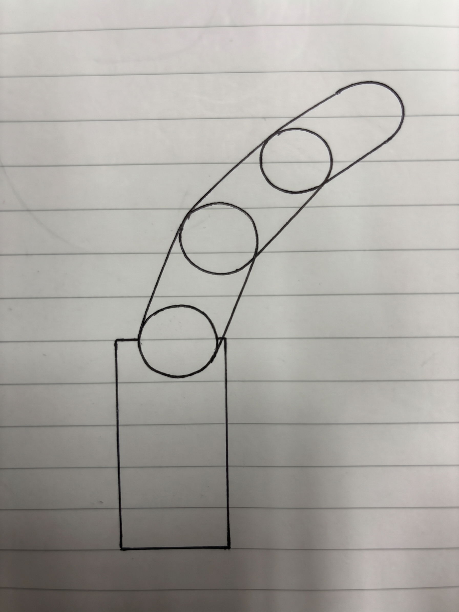
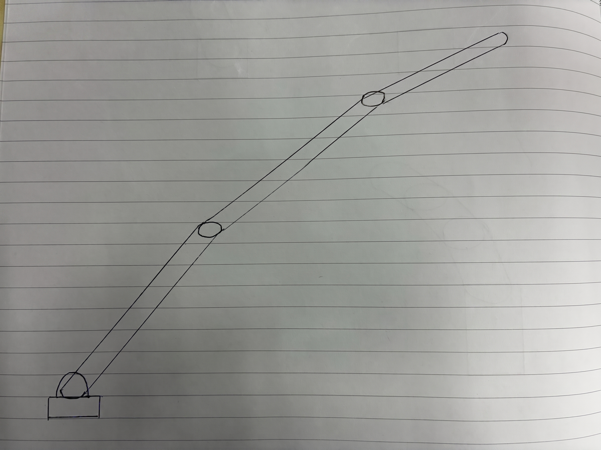
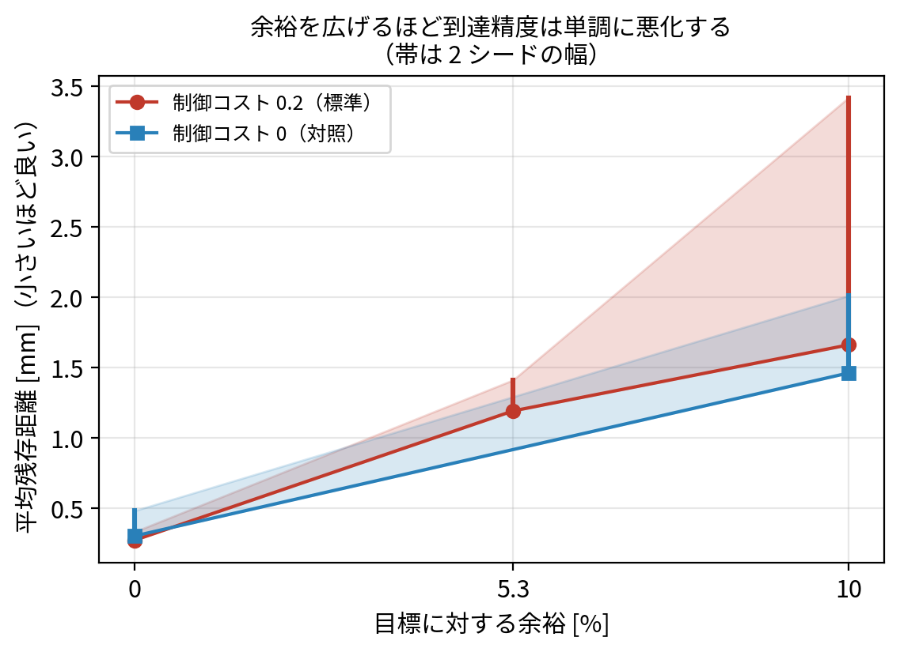

# 中間発表 原稿・構成案（2026年10月）

> **前提と未確定**
> - **発表時間は未定**。本稿は **15分** を想定して組んである。`[任意]` は落としても筋が通る。
>   20分なら `[任意]` を全部入れる。10分なら S4・S6・S10 を落として S3→S5→S7→S8→S9 で繋ぐ。
> - **「10月の形」は指導教員とのすり合わせが未実施。**
> - 数値は **2026-08-28 時点の確定値**。**実験はすべて完了しており、これ以上増減しない。**
> - 想定質問と回答は [研究応用/想定問答.md](研究応用/想定問答.md)（Q1〜Q9）。**発表前に必ず通読**。
> - ✅ **参考文献は整備済み**（2026-08-28、21 件を Crossref / arXiv の一次情報で確定）。`scripts/check_citations.py` が本文との双方向一致を検査する
>   [実験系譜.md](研究応用/実験系譜.md) と各章の本文中の書誌情報を参照すること。

---

## 全体の筋

**「作る前に、この形でこのタスクができるか知りたい」→ そのためのシステムを作った。**
→ システムの中核（co-design）は判定器として妥当か → **タスクごとに基準が変わるか（順位反転）**
→ 不適合なら何を返せるか → **その助言は本当に使えるのか**

**主軸は「システムを作った」こと。** co-design はその中核部品であって、発表の主役ではない。
**山場は S7（順位反転）と S8（助言は使えるか）の2つ。** ここだけは落とさない。

---

**2026-09-02 追記**: 手描き3枚（短い・標準・長い）を通し、**短いものだけが第1層で棄却された**。
絵が3枚並ぶだけで「スケッチを変えるとシステムの答えが変わる」が伝わるので、
**S4-2 を新設して山場の前に置いた**。素材は `data/test/{A1,B1,B2}/sketch/`。

**2026-09-07 追記**: 任意スライドを 2 枚足した。どちらも**時間が無ければ落とす**が、
突かれたときに口頭で出せるようにしておく。

- **S4-3**: 前段の成功率（**真横 5/5**、3/4 アングルは 0/2）と、落ちた原因の特定。
  「うまくいった例だけ見せている」への備え
- **S7-2**: 縦型 3 形態は**両タスクとも順位が seed で入れ替わる**（9-34）。
  「平面だけの話では」と突かれたときに、**別系統でも通用する主張と、しない主張を切り分けて**出す

**S8 に (4) を足した（2026-09-08）。** 第3層の「関節を固定してよい」＝**減らす助言**でも
閉ループが閉じた（9-27）。第1層の**増やす助言**と合わせ、**両方向で閉じた**と言える。
⚠️ **S7-2 が補強にならなくなったぶん、山場2 の重みはここで取り戻す。**

**S4-2 と S8-(3) の数値が変わった。** 助言から余裕 10 % の上乗せを撤去したので、
B1 への助言は **1.12 倍 → 1.02 倍**。S8-(3) は「実験が設計を否定し、
**その結論でコードを直した**」まで言い切る筋に変えた（9-30）。

## S1｜タイトル・位置づけ 【0:00〜1:00】

- 研究テーマ: 手描きスケッチからロボット形態のタスク適性を、試作前に検証する**システム**
- 修論（2027年2月）に向けた中間報告
- 中核に使う技術: Stackelberg PPO（ICLR 2026）— 形態と制御を同時最適化する co-design 手法

> 話し方: **「co-design の研究ではなく、co-design を部品として使ったシステムの研究」**と最初に言い切る。
> ここを曖昧にすると、以降ずっと「アルゴリズムの改善は？」という枠で聞かれる。

## S2｜課題 【1:00〜2:30】

ロボットアームの設計では、**形（形態）と動かし方（制御）が相互に依存する**ため、
「この形が良いか」は制御を仕上げてみるまで分からない。試作と検証のコストが高い。

既存技術で埋まっていない穴は2つ:

1. **スケッチには可動構造がない。** 画像や3Dメッシュを作る技術は成熟したが、
   「どこが関節でどこがリンクか」は入っていない
2. **形が作れても、タスクに向くかは分からない。** 形状生成の研究は「作る」までで、
   「動くロボットとして妥当か」の評価は射程外

> 話し方: ここで**「作ってから直す」のが今のやり方**だと言い切る。以降は全部その裏返し。

## S3｜提案するシステムと、何を評価するか 【2:30〜4:30】

```
スケッチ → [M1] 画像整形（関節に色マーカー）
        → [M2] 3D生成 → [M3] 関節検出・リンク分割 → [M4] パラメータ抽出 → [M5] モデル生成
        → [M6] Stackelberg PPO で co-design → 判定
        → [M7] 不適合なら「何がどうダメで、どう直すか」を返す
```

**設計の要点**: 関節構造を推定するのではなく、**入力側に規約を置いて推定問題ごと回避する**。
生成AIに「関節位置にマゼンタの球を描く」と指示し、3D化後に色検出する。
学習ベースの推定は一定確率で静かに間違えるが、色検出なら**失敗したら失敗と分かる**。

**システムとして評価する**ので、見る軸は4つある:

| 軸 | 何を問うか | スライド |
|---|---|---|
| 1 | 入力からモデルが確実に作れるか | S4 |
| 2 | 中核の判定エンジンは妥当か | S5〜S7 |
| 3 | 返した助言は使えるか | S8 |
| 4 | システムとして何秒/何時間で回るか | S9 |

**中核の位置づけ**: co-design を「より良い形を自動設計する手法」ではなく
**「人が発想した形の筋の良さを、制御の習熟まで含めて評価する判定器」**として転用する。
この用途ではトポロジー固定は制約ではなく仕様。

## S4｜[任意] 軸1: 入力からモデルは確実に作れるか 【4:30〜5:30】

決定論的なアルゴリズムを使えば頑健、とはならなかった。

- 生成AIは**指定したマゼンタをそのまま出力しない**。実測で公称値から最大 **86/チャネル**ずれる
- 公称色＋既定のしきい値では、**2つのメッシュとも検出に失敗**する
- しきい値を手で広げれば検出はできるが、必要な値がメッシュごとに違い、
  そこでは関節位置が **最大 12.8 mm** ずれる。両立する固定値が無い
- **基準色をメッシュごとに推定する処理**を前段に置いて初めて機能する（誤差 1 mm 以内）

> **主張**: システムの頑健性は個々のアルゴリズムの決定性ではなく、
> **外部サービスの出力ブレをどこで吸収するかという設計**で決まる。

## S4-2｜⭐ 手描き3枚を通したら、短いものだけが弾かれた 【4:30〜6:00】

> **このスライドが今回いちばん見せやすい。** 絵が3枚並ぶだけで話が通る。
> 素材は `data/test/{A1,B1,B2}/sketch/` に揃っている（手描き・M1 出力・GLB）。
>
> ⚠️ **S4（任意）と入れ替える。** 総尺を延ばさないため、時間が無ければ S4 を落として
> ここを入れる。S4 の色ドリフトの話より、絵が3枚並ぶこちらの方が伝わる。
> 両方入れるなら S6（任意）も落として 15 分に収める。

紙に描いた線画を3枚、同じ経路に通した。**変えたのは絵の大きさの比だけ**。

| | 手描き | XML の総リーチ | システムの答え |
|---|---|---|---|
| 短い |  | **0.789 m** | **❌ 届きません。腕全体を 1.02 倍に伸ばしてください** |
| 標準 |  | **1.010 m** | ✅ 可動範囲の内側（余裕 21 %） |
| 長い |  | **1.227 m** | ✅ 可動範囲の内側（余裕 35 %） |

- 関節の検出は **3 枚とも 3/3 が自動**。人が関節位置を教えていない
- この判定は **学習を一切していない**。約 1 秒で返る
- **紙の上で結果が予測できる**ようになった。B2 は描いた時点で「1.20 m」と見積もり、
  実際に出たのは 1.227 m（誤差 2 %）

> **主張**: **手描きの描き分けが、モデルの到達距離の違いとして保存され、判定の境界を跨いだ。**
> 絵を少し短く描くだけで、システムは「届きません」と理由と修正量を返す。

⚠️ **言い方に注意**: 「既存の short/mid/long を再現した」とは言わない。
既存 3 形態は 0.403 / 0.887 / 1.451 m（3.6 倍の幅）だが手描きは 1.55 倍と狭い。
**言えるのは「判定を跨いだ」まで。**

⚠️ **聞かれたら**: 「co-design の判定まで通したのか」→ **通した**。
手描き由来の形態で 4 例が完走している（平面 A1、縦型 A1v・A2v・B2v）。
このスライドは幾何診断（第1層・約1秒）だけで境界を跨げることを見せる場なので、
学習の結果は S7・S8 で扱うと繋ぐ。
⚠️ **B1 は意図的に学習させていない。** 第1層で棄却済みなので、
走らせると「学習せずに落とせる」という主張自体が崩れる。

✅ **画面に出る「1.02 倍」は、判定を覆すのに必要な最小の倍率**（2026-09-07 にコードを修正）。
以前は余裕 10 % を上乗せして 1.12 倍と返していたが、**その根拠は実験で否定された**ので撤去した。
S8-(3) で「助言の設計を実験が否定し、それに従ってコードを直した」という筋で回収する。
**これは弱点ではなく、システムとして評価したから見つかった話**として話す。

## S4-3｜[任意] 前段はどこで壊れるか — 4/5 が通り、落ちた1枚に原因があった 【6:00〜6:45】

> **時間が無ければ落とす。** ただし「成功率で語れる」ことと「失敗の原因が特定できている」
> ことはどちらも査読で効くので、聞かれたら口頭で出せるようにしておく。

手描き 5 枚を同じ経路に通した結果を、成功率として報告できる。

| 描き方 | 枚数 | 通過 | 落ちた原因 |
|---|---|---|---|
| 真横（正面） | 4 | **4 / 4** | — |
| **3/4 アングル** | 1 | **0 / 2 試行** | Tripo3D が**腕を寝かせた**。関節の Z 差が潰れて分割不能 |

- 落ちたのは A3（3/4 視点で描いた1枚）。**同じ M1 画像で 2 回試して 2 回とも同じ**なので、
  生成のばらつきではなく**入力側（描画角度）に起因する**
- 検出は自動化してある（`check_glb_pose.py`）。Z 方向の広がりが 0.36〜0.63 なら通り、
  A3 は 0.017 / 0.028 しかなかった。**学習に入る前に弾ける**

> **主張**: 前段の頑健性を **4/4（真横）** と報告でき、
> **落ちる条件も「3/4 で描くと寝る」と特定できている**。
> 「うまくいった例だけ見せている」という疑いに、こちらから答えられる。

⚠️ **3/3 とは言わない。** A 群は 3 枚のうち 1 枚（A3）が落ちているので **2/3**。
真横だけに限れば 4/4。**どちらの数え方をしているか必ず明示する。**

---

## S7-2｜[任意] 縦型でも同じ傾向が出た 【任意・S7 の補強】

> S7（山場1）で時間が余ったとき、または「平面だけの話では」と突かれたときに出す。

手描き由来の**縦型 3 形態**を、両タスク・各 2 seed で回した。

| | A1v（余裕 20 %） | A2v（32 %） | B2v（35 %） |
|---|---|---|---|
| Reach | −13.65 / −14.29 | −14.64 / **−10.95** | −19.67 / **−10.60** |
| Pusher | 348.56 / 340.39 | 150.96 / **430.28** | 184.03 / **475.71** |

⚠️ **順位は主張しない。両タスクとも seed で入れ替わる**（9-31・9-34）。
1 seed の段階では「Reach は単調悪化」「Pusher は A1v が突出」と読めたが、
**2 seed 目でどちらも崩れた**。

**このスライドで言うこと**は次の 2 点だけにする。

1. **手描き由来の縦型でも学習が通り、両タスクとも目標に到達する**（第3層で確認、9-29 ④）
2. **縦型は seed 依存が大きい**。Reach の幅は A1v 0.64 に対し B2v は **9.07**。
   **A1v（最も短い腕）だけが両タスクとも安定している**

**「余裕は単調に害」の根拠は `pj_*` の梯子（S7）のみ**である。
あちらは**同一形態を余裕だけ振った統制実験**で、各 2 seed で隣接条件の範囲が重ならない。
このスライドを傍証として足さないこと。
**このスライドで言うのは「到達の単調悪化」だけ**にして、押しは
「seed 依存が大きく順位は言えない」と添える。

> **これも隠さず言う。** 「1 seed のときは A1v が突出して見えましたが、
> seed を足したら消えました」まで話す。**留保を先に書いていたので撤回で済んだ**
> という筋は、S8 の「実験が設計を否定した」と同じ形で効く。

---

## S5｜軸2: 判定エンジンは妥当か（タスク識別）【6:00〜8:00】

タスク以外の条件をすべて揃え、3タスク × 各2シードで比較した。

| タスク | 収束したギア比 | 総リーチ | 行動 |
|---|---|---|---|
| Pusher（押す） | 肘が上限 400 | 1.2〜1.7 m | **一撃で吹き飛ばす** |
| Reach（届く） | 肩が下限 20 | 0.9〜1.1 m | サブミリ精度で静止 |
| Target-Pusher（狙って止める） | 高ギア（Pusher 寄り） | 1.1〜1.5 m | **押して止める**（誤差 0.5 cm） |

- 分離は**個別パラメータではなく機能量**（ギア比プロファイル・リーチ帯・行動類型）で現れた
- 2シードを跨いで一致。タスク内の個別値はシード間で分散する

> **主張**: 中核エンジンはシンプルな報酬だけで、タスクの要求を形態と行動に正しく反映する。

## S6｜[任意] 軸2: 与えた形を順序づけられるか 【8:00〜9:00】

S5 は「エンジンに形を**作らせた**」話。システムが実際にやるのは「形を**与えて**順位を付ける」ことなので、
そちらも直接試した（前向き判定）。パイプライン生成形態を 0.5倍・1.8倍にスケールし Reach で比較:

| 形態 | 総リーチ | 目標 0.8 m | スコア |
|---|---|---|---|
| 短腕 | 0.403 m | 届かない | **−396.92** |
| 長腕 | 1.451 m | 届く | **−12.48** |

⚠️ **注意して話す**: 順位が確定したのは **ep27**。手作りアームでは ep0 で確定していたが、
**これは一般化しない**。早期に打ち切ると良い形と悪い形を取り違える。

## S7｜⭐ 山場1: タスクごとに基準が変わるか 【9:00〜11:00】

**批判**: 「結局『長い腕ほど良い』と言っているだけでは？」

これに答えるため、**同じ3形態を2タスクにかけた**。変えたのはタスクだけ。

| 形態 | 総リーチ | Reach | Pusher |
|---|---|---|---|
| 短腕 | 0.403 m | −396.92（3位） | −0.00（3位） |
| **中間** | 0.887 m | **−3.42（1位）** | 34.32（2位） |
| **長腕** | 1.451 m | −12.48（2位） | **96.18（1位）** |

**中間と長腕の順位が入れ替わった。**

- Reach は「目標距離への適合」を要求 → 余った長さは慣性と姿勢の自由度になり不利
- Pusher は「先端速度」を要求（角速度 × リーチ）→ 長さがそのまま有利

> **主張**: 判定器は形の絶対的な大きさではなく、**タスクの要求に照らして**形を評価している。

**シード間の一貫性**: 反転の要である Reach の中間 vs 長腕は2シードで確認し、
中間の最悪値（−3.42）が長腕の最良値（−10.27）を上回る＝**スコア域が重ならない**。

⚠️ **正直に言うこと**: Pusher 側は 200エポックで未収束（下位条件が伸び続けている）。
**順位は主張するが、何倍という比率は主張しない。** 1000エポック版を実行中。

## S8｜⭐ 山場2: 返した助言は本当に使えるのか 【11:00〜13:30】

「向いていません」だけでは、ユーザーが作り直すのを繰り返すだけで支援にならない。
そこで**幾何・収束設計・行動の三層**で診断を実装した。第1層は学習不要・約1秒で返る。

```
❌ 腕が短すぎて目標に届きません（届く範囲 0.403 m、目標は 0.800 m 先）。
    → 腕全体を N 倍に伸ばしてください。
```

**ここからが本題。この助言に従ったらどうなるかを、実際に試した。**

### (1) 助言に従わせたら、同じシステムがまた却下した

```
0.403 m の腕 → システム「1.98 倍以上に伸ばしてください」
            → その通り 1.98 倍にした（0.798 m）
            → 同じシステムがまた却下「腕が短すぎて届きません」
```

必要な倍率は 1.9846 倍。それを小数第2位に**四捨五入したせいで切り捨てられ**、
**助言どおりに直しても 2 mm 足りなかった**。切り上げに修正した。

> **ここが今回いちばん伝えたい知見**:
> **判定が正しいことと、助言が使えることは別物。**
> 診断の判定は6条件すべて実測と一致していた。それでも助言は使えなかった。
> この欠陥は「判定が当たるか」を調べる枠組みでは**原理的に見つからない**。
> 助言を適用した形を作って**もう一度入れ直す**まで分からない。

### (2) 是正後は、助言に従えばタスクが達成される

| 形態 | 倍率 | 第1層の判定 | best | 平均残存距離 |
|---|---|---|---|---|
| 元の形態 | 1.00 | 不適合 | −396.92 | **397 mm** |
| 助言の下限を適用 | 1.99 | 適合 | **−0.33 / −0.27** | **0.33 / 0.27 mm** |

**残存距離が 397 mm から 0.3 mm へ、3 桁改善した。** 2 シードとも。
「システムの助言に従えば、達成できない形が達成できる形になる」ことが実証できた。

### (3) ⚠️ ただし「余裕を持たせよ」という当初の設計判断は**実験に否定された**

是正のとき、下限ちょうどでは腕を伸ばしきった姿勢になるため
「余裕 10% を含めた値を推奨する」設計にした。**これが間違いだった。**

| 余裕 | 0%（1.99倍） | 5.3%（2.09倍） | 10%（2.20倍） |
|---|---|---|---|
| best（2 seed） | **−0.33 / −0.27** | −1.41 / −1.19 | −3.42 / −1.66 |

**到達タスクでは余裕が増えるほど単調に悪化する。** 制御コストを完全に外しても同じだった。



> 図は `python3 scripts/make_thesis_figures.py ladder` で①原本から再生成できる。**数値を手で直さない。**
一方、押しタスクでは下限（2.11倍）29.25 に対し余裕 10%（2.20倍）34.32 で**余裕がある方が良い**。

> **必要な余裕はタスクに依存する。** 「安全側に倒す」という設計者の直感は、
> 到達タスクでは逆効果だった。**自分の設計判断を実験で否定できたこと自体が、
> システムとして評価する枠組みを持っていた成果**である。

> 話し方: **失敗として話さず、システムとして評価したから見つかった発見として話す。**
> 「部品ごとに評価していたら、この2つの欠陥は修論に載ったまま提出されていました」で締める。

**そして 2026-09-07 に、この結論に従ってコードを直した。** 助言は余裕を上乗せせず、
**判定を覆すのに必要な最小の倍率**だけを返す（S4-2 の「1.02 倍」がそれ）。
最小変更は Wachter ら・Ustun らの反実仮想説明が理論的に要請するものでもあり、
**理論上の要件と実験結果が同じ設計を指した**。

> 話し方: 「実験が設計を否定し、その結論でコードを直しました」まで言い切る。
> **否定されたまま放置していないこと**が、部品評価では届かない部分。

### (4) ⭐ **「減らす助言」でも閉ループが閉じた**（2026-09-04 完走、9-27）

ここまでは第1層の「**腕を N 倍に伸ばせ**」＝**設計を増やす**助言だった。
第3層は逆に「**この関節は使っていないので固定してよい**」＝**設計を減らす**助言を返す。
これも同じ手順で確かめた。

```
第3層「関節3 は可動域の 7 % しか使っていません。固定してよいです」
     → 本当に関節3 を固定した形態を作る（リンク長・太さ・質量は完全に同一）
     → 学習し直す
```

| タスク | 可動 | **固定** | | 第3層の助言 |
|---|---|---|---|---|
| **到達** | −6.30 | **−5.32** | **良化** | **出ていた**（使用率 7 %） |
| **押し** | 203.40 | **179.89** | **悪化** | 出ていない（使用率 41 %） |

**押しの行が本題である。** 「固定しても平気」だけなら「そもそも要らない関節だった」で終わる。
**同じ関節が、到達では余っていて、押しでは必要**だと示せたので、
**診断が関節の要不要をタスクごとに読み分けている**ことまで言える。

> **これで増やす側と減らす側の両方で閉ループが閉じた。**
> 第1層（増やす）: −396.92 → −0.33
> 第3層（減らす）: −6.30 → **−5.32**

⚠️ **限定を添える**: 各条件 **1 seed** なので、主張するのは**向き**だけ。
(2) の梯子のような幅は言わない。

> 話し方: 「助言が正しいことだけでなく、**助言を出さなかった判断も正しかった**」まで言う。
> 診断が黙っている側を検証した例は他に無い。

⚠️ **限定を必ず添える**: 反実仮想的な助言を返せるのは幾何の層だけ。
「届くが遅い」には原因を報告できるが、直し方は返せない。

## S9｜軸4: システムとしての到達点と所要時間 【13:00〜14:15】

**1周あたりの費用は二極化している**

| 工程 | 所要 |
|---|---|
| モデル生成・幾何診断・三層診断 | **合計 数秒**（学習不要） |
| 判定（設計が明確に異なる候補） | 約 4 時間 |
| 判定（候補が拮抗する場合） | 約 16 時間 |

→ **幾何的に破綻した形は、学習を待たずに数秒で棄却して直し方を返せる。**
実際にマトリクスの6条件中2条件は学習なしで処理された。
明らかに届かない案を何度描き直しても費用がほとんど増えない。ここがフェーズ0 支援としての価値。

**この夏に閉じた2つの限界**（前回説明した時点では未検証だった）

1. **非平面形態でもタスク識別が成立した。** 可動平面を向け直せる4関節アームで到達・押しの
   両タスクを各2シード実行したところ、**先端リンクの太さが到達=下限 0.030 / 押し=上限 0.100 で分岐**した
   （4本とも探索範囲の端）。平面形態で見つけた署名が**非平面で独立に再現**しており、
   タスク識別は形態クラスに固有の現象ではない。
2. **幾何が原理的に区別できない形態対も順序づけられた。** 総リーチを 0.887 m に固定して
   リンク長の配分だけを反転させた2形態は、**第1層が文字通り同一の出力しか返せない**。
   これを到達タスクで比較すると根元重 −1.65/−1.81 対 先端重 −4.39/−5.75 で
   2シードとも域が重ならない。**幾何の外側を co-design が埋めている**具体例。

⚠️ 正直に添えること: 押しタスクで同じ比較をすると差が 1.03〜1.49 倍まで縮み、
均等配分とは区別できなかった。**配分の効き方はタスクに依存する。**

**残り（修論まで）**

- **手描きスケッチからの E2E 実走** — **4 例通した**（2026-09-01〜04、A1・B1・B2・A2）。4 件とも関節検出 3/3・公称=実効一致で、幾何診断は**3 件を到達可能・1 件を到達不能**と判定し**判定を跨いだ**。**(b) co-design 判定まで含めた通しも達成済み**（A1 を平面 1 seed・縦型 2 seed で学習まで完走）。残るのは (a) 成功率を出せる枚数、(c) M1・M2 が Web インタフェース経由で全自動化されていない点
- シード数の拡大、利用者を対象とした評価、M1・M2 の API 自動化

## S10｜[任意] 限界 【14:15〜15:00】

正直に述べておく点:

- **シミュレーションのみ。** 実機検証・sim-to-real はスコープ外と明示的に宣言している
- **「人手ゼロ」と言えるのは関節検出以降。** 画像整形と3D生成は Web 経由で人手が残る
- **利用者実験をしていない。** 「専門知識がなくても使える」とは主張していない。
  示したのは入力と出力の形式が専門知識を要求しないところまで
- **各条件1〜2シード**で統計的検定はしていない。「頑健」という語は使わない
- **非平面形態は形態の署名が安定な一方でスコアが不安定。** 押しタスクの到達値は
  シード間で 2.1 倍開く（124.36 対 263.14）。**識別の成立は主張するが、到達性能の水準は主張しない**
- **配分の軸で検証したのは到達タスクのみ強い結論。** 押しタスクでは差が縮み、
  均等配分と区別できなかった

---

## 発表前チェックリスト

- [ ] 発表時間を確認し、`[任意]` スライドの取捨を決める
      （任意は S4・S6・**S4-3**・**S7-2**・S10 の 5 枚。15 分なら山場 S7・S8 を必ず残す）
- [ ] ⚠️ **A2v・B2v の Pusher seed=1 の完走を確認**（S7-2 の「逆転は確認中」を更新できるか）
- [ ] 指導教員と「10月の形」をすり合わせる
- [x] ~~⚠️ **修論の参考文献リストを整備する**~~ → **2026-08-28 完了**。21 件すべてを Crossref / arXiv の一次情報で確定し、`scripts/check_citations.py` が本文とリストの双方向一致を検査している
- [x] ~~⚠️ 印の数値を再確認する~~ → **2026-08-28 時点で全実験が完走。数値は確定済み**（Pusher の 1000ep 比率も 2.97 倍で確定）
- [x] ~~S8 を最新の結果に差し替える~~ → **2026-08-28 実施済み**（是正後の有効性と、余裕が単調に害である結果を反映）
- [ ] [研究応用/想定問答.md](研究応用/想定問答.md) の Q1〜Q9 を通読。
      **Q4（長い腕ほど良いだけでは？）は S7 で、Q8・Q9（システムと言えるのか／利用者評価）は S9・S10 で先回りする**
- [ ] 図の準備: S3 のパイプライン図（**未作成・手描き必要**）、S4 の色ドリフト（`figures/marker_tolerance.png`）、S7 のマトリクス（`figures/matrix_reversal.png`）、S8 の余裕の梯子（**`figures/margin_ladder.png` 作成済み**）と診断出力・閉ループ図。形態の静止画は `scripts/eval_morphology.py`
      S8 の余裕の梯子（**`figures/margin_ladder.png` 作成済み**）と診断出力・閉ループ図。形態の静止画は `scripts/eval_morphology.py`（3アングル出力）
- [ ] **S4-2 の画像3枚をスライドに貼る**（`data/test/{B1,A1,B2}/sketch/*_hand.*`）。
      手描き・M1 出力・GLB の3段で見せてもよいが、時間が無ければ手描きだけで通る
- [ ] S4-2 で「既存の short/mid/long を再現した」と**言わない**（幅が違う。言えるのは「判定を跨いだ」まで）
- [ ] S4-2 で「co-design の判定まで通したのか」と聞かれたら **「通した」**と答える（手描き由来 4 例が完走済み：平面 A1、縦型 A1v・A2v・B2v）。ただし **B1 は意図的に学習させていない**（第1層で棄却済みなので、走らせると主張が崩れる）

## 話し方のメモ

- **S7 と S8 に時間を残す。** S4〜S6 を巻いてでも、この2枚は丁寧にやる
- **主軸はシステム**。「co-design がすごい」ではなく「co-design を部品にしたシステムが動く」と言う。
  S1 と S3 と S9 で3回繰り返す
- 未収束・1シード・スコープ外は**こちらから先に言う**。指摘されてから認めるより印象が良く、
  この研究は限界を自分で見つけて記録してきた経緯があるので、そこは強みとして話せる
- **S8 は自虐で終わらせない。** 「システムとして評価する枠組みを持っていたから見つかった」
  という方法論の主張に着地させる
