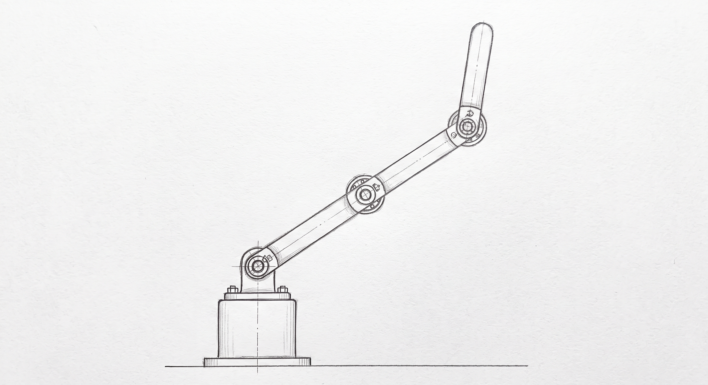
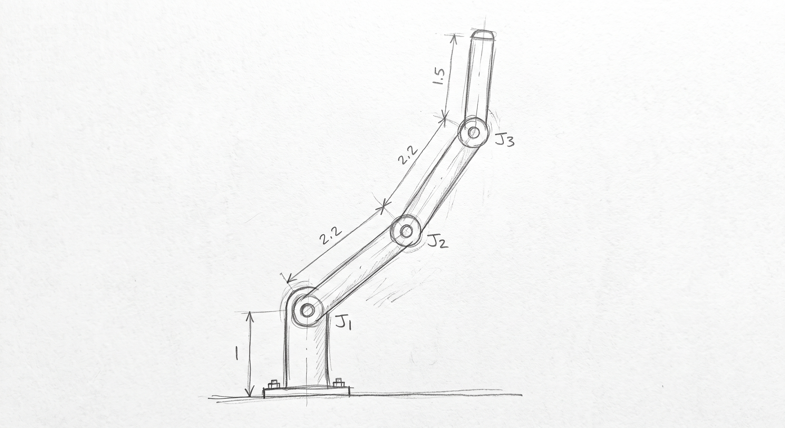
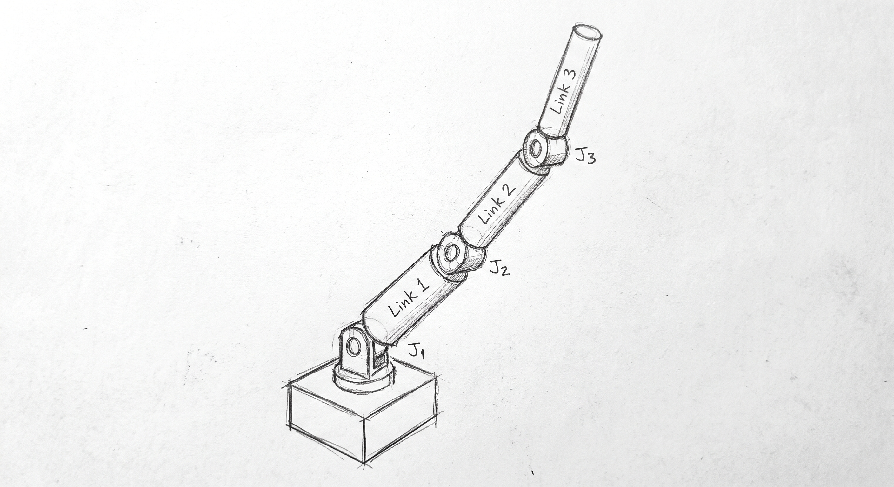
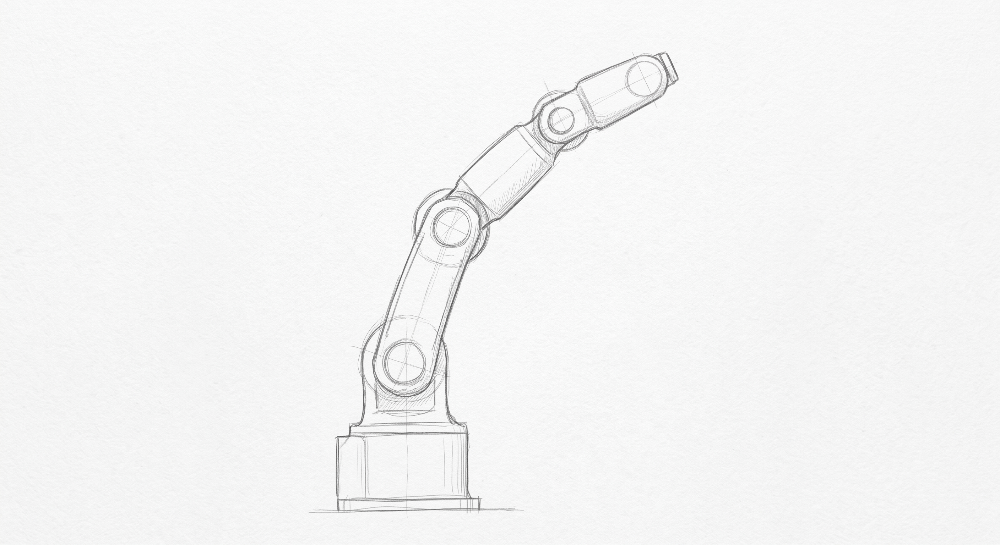
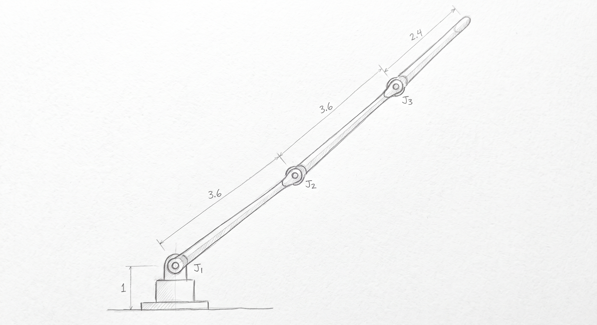
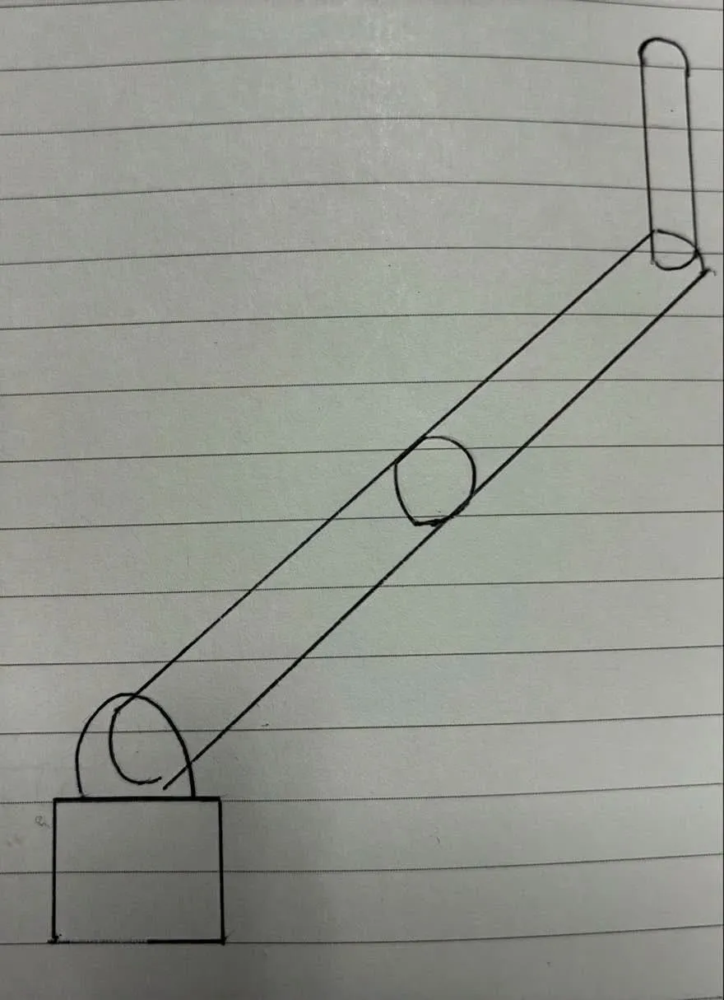
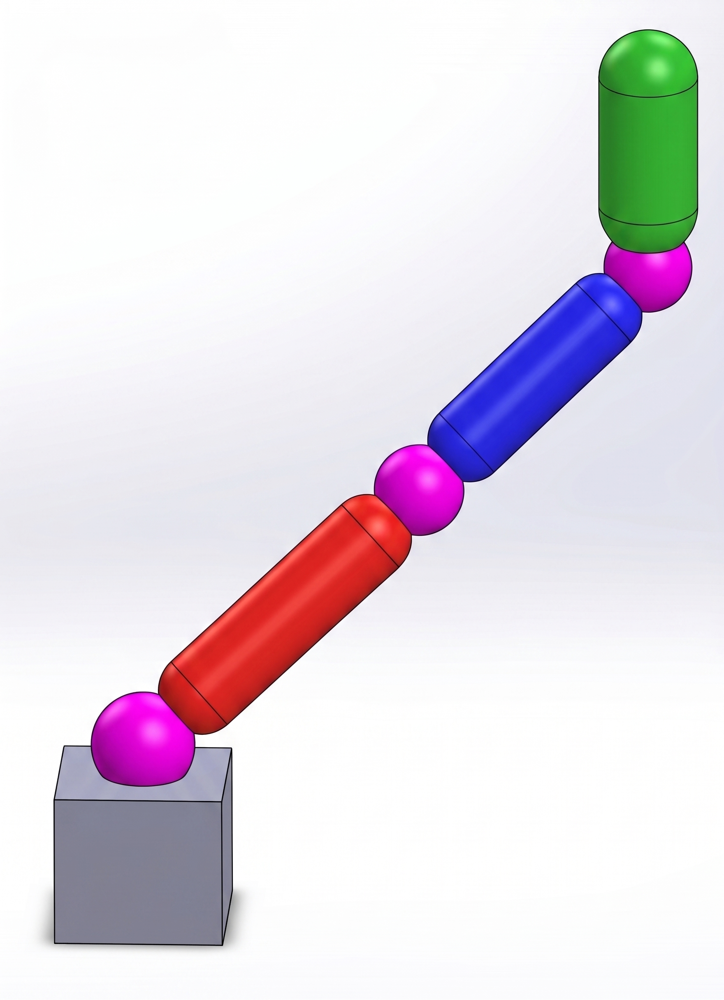

# E2E 実走: 手描きスケッチを入力とする実験の手順

> **状態（2026-09-01 夜）**: **A1 は手描き → M7 第1層まで完走。残り4枚が未着手。**
> 手描き1枚から XML と診断まで、人手の介在なしに通った（[A1 の実走記録](#a1-の実走記録2026-09-01)）。
> **懸案だった「描いた比が XML まで残るか」は、通した範囲で肯定された**（4.8 → 4.6 → 5.18）。
> 残るのは「**描き分けが順位として残るか**」。**次にやるのは B1 を同じところまで通して総リーチを比べること。**
> 9/1 に、B群の比を概算から **XML 実測値** へ具体化し、M1 プロンプトに 1枚ごとの
> 比のロックを足した。Gemini にスケッチ自体を描かせる場合のプロンプトも付録に置いたが、
> **生成画像をそのまま実走の入力にはできない**（理由は付録冒頭）。
> 9/1 に入力の作り方を決めた: **生成画像を参照として人が紙に模写し、その紙を入力とする**
> （「入力の作り方」節）。入力は人が描いた紙なので E2E の主張は成立し、
> かつ参照を固定することで A群から設計意図の drift が除ける。
>
> **目的**: 修論に残る唯一の実験由来の空欄「手描きスケッチを入力とする end-to-end の実走」
> （第4章 4.5.3、第5章 5.7.2 の限界13、第6章 6.5）を埋める。
> あわせて第6章 6.4.2(2) の「規約準拠メッシュが2件しかなく前段の頑健性を成功率で report できない」
> という限界を、**手描き5枚の成功率**として測れる形にする。

## この5枚に決めた経緯（2026-08-31 の検討）

当初案は「同じ趣旨のものを3パターン、まったく違う形をあと2個くらい」だった。
枚数と大枠はそのまま採用し、**B群の2枚に役割を持たせる**点だけ変えている。

### なぜ B群を「短い」「長い」にしたか

「まったく違う形」を自由に選ぶと、**判定器が評価できない軸で違ってしまう**恐れがある。
たとえば車輪型や多指ハンドは、形は確かに違うが本システムの判定軸（到達可能性・質量分布）の
外側にあり、結果が出ても既存の主張と繋がらない。

そこで**既存の short / mid / long の構造**（4.3.3.3 のマトリクス判定）を手描きで再現する形にした。
A群が mid に相当するので、B群で両端を作れば

    短い（幾何で棄却）→ 標準（A群）→ 長い（学習で判定）

という3段階になり、**E2E の結果が既存の実験結果へ接続する**。
「手描きでも動いた」で終わらせず、「手描き入力で既存の主張を再現した」と言えるようになる。

### なぜ A群は「同じ絵を3回」ではないか

A群の目的は前段の頑健性を**成功率**にすることであって、再現性の確認ではない。
同じ絵を丁寧に3回描くと、入力のばらつきがほぼゼロになり何も測れない。
測りたいのは「**描画が揺れても同じ形態が出るか**」なので、
丁寧／フリーハンド／斜めと意図的にばらつかせる。

### 想定される結果と、そのときの扱い

| 結果 | 扱い |
|---|---|
| A群3枚が同じ形態クラスへ収束 | 前段の頑健性を **3/3** として報告。6.4.2(2) の限界が埋まる |
| A群がばらつく | 「**描画のばらつきが形態へ伝播する**」という新しい限界として報告する。これも成果であり、失敗ではない |
| B1 が第1層で棄却され修正倍率が返る | **E2E の実演として最も強い**。学習不要で数秒。中間発表でそのまま見せられる |
| B1 が第1層を通ってしまう | 描き分けが生成過程で失われた可能性。生成画像を確認し、比が保存されているか見る |

### 判断の前提として確認したこと

- **手描きにマゼンタは不要**。M1（Gemini）が規約を適用する。手描きは構造が読み取れる線画でよい
- **避けるべき形は憶測ではなく既存の失敗記録から採った**（把持の見送り＝方針レビュー ②、
  chain モードの Z 仮定＝UR3 分割失敗の主要因、チョップ問題＝2026-07-09）
- **絶対スケールでは描き分けられない**（生成モデル依存でスコープ外と宣言済み。6.4.2(3)）

## 描く5枚

**手描きにマゼンタは不要。** M1（Gemini）が規約を適用して設計図スタイルへ変換する。
手描きは「どんな腕にしたいか」が伝わる線画でよい。

### グループA: 同一趣旨 × 3 — 前段の頑健性を成功率にする

同じ設計意図（3関節・リンク比おおむね 1 : 1 : 0.7）を、**描き方を変えて**3枚。
⚠️ **同じ絵を3回描いても意味がない。** 描画のばらつきに対して同じ形態が出るかを見る実験なので、
意図的に雑さ・角度・線質を変えること。

| # | 描き方 | 参照画 |
|---|---|---|
| A1 | 定規を使って丁寧に、正面（真横）から |  |
| A2 | フリーハンドで速く、正面から |  |
| A3 | やや斜め（3/4 アングル）から、リンクの太さを描き分けて |  |

### グループB: まったく違う形 × 2 — 既存実験に接続する

既存の short / mid / long の構造（4.3.3.3 のマトリクス判定）を手描きで再現する。
A 群が mid に相当するので、両端を作る。

| # | 形 | 狙い | 参照画 |
|---|---|---|---|
| B1 | **短くずんぐり**（= 既存 `short` 相当） | 第1層が学習ゼロ・数秒で「届きません、N 倍に伸ばしてください」と返すはず。**発表での実演に最適** |  |
| B2 | **極端に長く細い**（= 既存 `long` 相当） | 幾何は通るが Reach では過剰。学習が要る側の例 |  |

### 描く比（一次データ = XML 実測から。2026-09-01 に具体化）

当初は「台座の高さに対しリンクが半分程度／3倍程度」と概算で書いていたが、
**B群の狙いは既存 short / long の再現**なので、XML から実寸を取って比に直した。
概算のままだと B1 が `short` よりさらに短くなり、「既存実験に接続する」という狙いから外れる。

**台座（ベース）の高さを 1 とする単位で描く。**
絶対スケールは Tripo3D 側で決まり制御できない（6.4.2(3)）ため、比だけを守る。

| # | 相当 | 台座高 | リンク1 | リンク2 | リンク3 | 総リーチ |
|---|---|---|---|---|---|---|
| A1〜A3 | `mid`（0.887 m） | 1 | 2.2 | 2.2 | 1.5 | 5.9 |
| B1 | `short`（0.403 m） | 1 | 1.0 | 1.0 | 0.7 | 2.7 |
| B2 | `long`（1.451 m） | 1 | 3.6 | 3.6 | 2.4 | 9.7 |

リンク間の比はどれも **1 : 1 : 0.7** で共通（3形態はスケール変種なので当然）。
違うのは台座に対する倍率だけであり、**そこだけを描き分ける**。

実寸の目安: 台座を 2 cm で描くと A群 4.4 / 4.4 / 3.0 cm、B1 2.0 / 2.0 / 1.4 cm、
B2 7.2 / 7.2 / 4.8 cm。関節で折り曲げるので B2 も A4 縦に収まる。

⚠️ **絶対的な大きさで描き分けないこと。** 生成モデルが出力する絶対スケールは制御できず、
スコープ外と宣言してある（6.4.2(3)）。**台座の高さに対するリンク長の比**で描き分ける。

## 描くときに避けるもの（すべて既存の失敗記録に基づく）

| 避ける | 理由 |
|---|---|
| 指・グリッパ・2指の分岐 | 把持は修論のスコープ外（方針レビュー 2026-08-03 ②）。判定軸が「腕の形」から「ハンドの形」へずれる。分岐点は関節1個か2個か Gemini が誤る実績あり（メッシュ分割.md） |
| 水平に伸びた姿勢 | `glb_to_links.py` の chain モードは「根元が高 Z・先端が低 Z」を仮定する。UR3 の分割失敗の主要因がこれ |
| 関節が同じ高さに並ぶ形 | 同上。Z オーダリングが崩れる |
| 平たい板状の手先を面で描く | チョップ問題（面法線がスイング方向と直交し、薄い側面が先行する。2026-07-09） |
| 関節数を 3 から変える | 比較に交絡が入る。5枚とも3関節で揃える |

**基本形**: 台座から**縦に立ち上がる**3関節シリアルアーム、横から見た図。

## Gemini へ渡すプロンプト（手描き入力版）

付録Aの固定プロンプトは「ゼロから生成」用なので、**手描きを入力に取る形へ書き換えてある**。
手描き画像を添付して以下を貼る。

```text
添付した手描きスケッチのロボットアームを、下記の仕様に従って
機械設計図スタイルの画像に描き直してください。

【最優先: スケッチの構造を保つこと】
- リンクの本数、各リンクの長さの比、関節の位置は、スケッチに忠実に従うこと
- スケッチにない関節を足したり、あるものを省いたりしないこと
- 全体のプロポーション（台座の高さに対する各リンクの長さの比）を変えないこと
- 台座の高さを 1 としたとき、リンクの長さは根元から 2.2 / 2.2 / 1.5 である。この比を変えないこと
- スケッチが粗くても、読み取れる構造をそのまま反映すること。
  「きれいに直す」ためにリンク長の比を変えるのは禁止
- スケッチの紙にある罫線は無視すること。罫線を図の一部として描かないこと

【形状・姿勢 — 最重要】
- 固定台座から垂直に伸びるシリアルチェーンアーム（根元が下・先端が上）
- 各リンクは円柱カプセル。先端リンクのみ、やや太い円柱でよい
- 関節が同じ高さに並ばないよう、各リンクに角度をつけて描くこと

【関節マーカー — 最重要・省略厳禁】
すべての接続部に、純マゼンタ (#FF00FF) の球を1個ずつ描くこと。具体的には以下の3箇所:
1. 台座と上腕（赤）の間
2. 上腕（赤）と前腕（青）の間
3. 前腕（青）と先端（緑）の間 ← ここも省略しないこと
- スケッチで隣り合うリンクがほぼ一直線に並んでいる場合も、その境目に必ずマゼンタ球を描くこと。
  2本のリンクを1本の長いリンクとして描くのは禁止
- 3箇所すべて同じ様式（リンクより太いマゼンタの球）で統一すること。
  先端側の関節だけを金具・ヒンジ・ブラケット等の機械要素で描くのは禁止
- 描き終えたら、マゼンタの球がちょうど3個あることを確認すること

【色分け — グラデーション禁止・各色を単色で塗ること】
- ベース台座: 濃いグレー (#333333)
- リンク1（上腕）: 鮮明な赤 (#FF2222)
- リンク2（前腕）: 鮮明な青 (#2222FF)
- リンク3（先端）: 鮮明な緑 (#22CC22)
- 関節球: 純マゼンタ (#FF00FF)
  ※ マゼンタはアーム本体色（赤・青・緑・グレー）には絶対に使わないこと（自動検出用のため）

【スタイル】
- 白背景
- CADソフトウェアのレンダリング風（プラスチック質感・影あり・幾何学的）
- 斜め45度視点（3/4アングル）、ロボット全体が収まる構図
```

**2026-09-01 の追記3点**（A1 を投げる直前に、実際の手描きを見て必要と判明したもの）:

| 追記 | なぜ要るか |
|---|---|
| 比を数値で書く（`2.2 / 2.2 / 1.5`） | 「スケッチに忠実に」だけでは定性指示にすぎず、生成側が整える過程で比が動く。**1枚ごとに数値を差し替える**（下の表） |
| 罫線を無視させる | 罫線紙に描いた場合、横線を図の一部として拾いうる |
| 一直線に並ぶ境目にもマーカーを描かせる | A1 実物では上腕と前腕の角度差が 2° しかなく、**2本を1本の長いリンクとして描かれる**恐れがあった。既知の失敗（先端側の関節が金具として描かれマーカーが落ちる）と同種だが、危ないのが中間関節である点が違う |

⚠️ **「最優先」節が今回の追加点。** 既存プロンプトは形状を指定して生成させるものだったが、
今回は**手描きの構造を保存させる**ことが実験の前提になる。
Gemini が「きれいに直す」過程でリンク長の比を変えてしまうと、
B1・B2 の描き分けが消えて実験が成立しない。**生成画像を必ず目視で確認すること。**

## 参照画の確認結果（2026-09-01、`docs/sketch/` の5枚）

付録プロンプトで生成した5枚を確認した。**画像から目視で読んだ概算（±10% 程度）。**

| # | 構造 | 禁止事項 | 総リーチ÷台座高 | 目標 | 判定 |
|---|---|---|---|---|---|
| A1 | 3関節・上向き・分岐なし・関節の高さ違い | 文字なし | **3.5** | 5.9 | ⚠️ 短い |
| A2 | 同上 | ❌ 寸法線・`J1/J2/J3`・数値 | **4.3** | 5.9 | ⚠️ 短い |
| A3 | 3/4 視点・太さの差あり | ❌ `Link 1/2/3` の文字 | **3.9** | 5.9 | ⚠️ 短い |
| B1 | 同上 | 文字なし | **2.9** | 2.7 | ✅ |
| B2 | ⚠️ ほぼ一直線（曲げがない） | ❌ 寸法線・数値 | **8.1** | 9.7 | ⚠️ やや短い |

**① A群が B1 と離れていない（最重要）。** 3.5〜4.3 に対し B1 が 2.9 で、差は 1.2〜1.5 倍しかない。
設計では 2.2 倍離して「短い→標準→長い」の3段を作るはずだった。**下側が潰れている。**
B1・B2 は目標に近いので、直すのは A群。

**② 文字と寸法線（A2・A3・B2）。** プロンプトで禁止したが Gemini が比の数値を寸法線として描いた。
模写のとき写さなければ済む。ただし **A2 のラベルは描画と合っていない** —
`2.2` と書いた線を実際には 1.6 相当で描いている。**数値は信用せず線の長さだけ見る。**

**③ 姿勢**: B2 がほぼ一直線で「各リンクに角度をつける」を満たしていない。
関節が同じ高さには並んでいないので Z 順序は壊れない。B1 の第3リンクも水平から 22° と浅い。

### 対処: 比の修正は模写のときに行う（再生成しない）

参照画からは**姿勢と画風だけ**を取り、**リンク長は比の表から取る**。
紙の上で台座高を測り、その倍率でリンクを置いてから線を引けばよい。模写する以上コストはゼロで、
参照画の比の誤差を持ち込まずに済む。A群は下描きで関節位置を決めてから、
A1 は定規で、A2 はフリーハンドで速く引く（ばらつきは線質から出る）。

## ⚠️ 未検証の前提: 描いた比が XML まで残るか（2026-09-01 判明）

**B群の設計は「描いた比の違いが総リーチの違いとして XML に残る」ことを前提にしているが、
これは一度も検証されていない。** 参照画を確認する過程でコードを読んで判明した。

### コードが実際にやっていること

| 事実 | 場所 |
|---|---|
| `mesh_to_params.py` を **`--scale` なし**で呼ぶ → GLB の単位をそのまま m として使う | `run_tripo_pipeline.sh` Step 2 |
| `FIXED_BASE=1` で **台座は可動リンクから除外**される | 同 Step 2 |
| XML の台座高 **0.15 はハードコード**。スケッチ由来ではない | `topology_to_xml.py:40` |

したがって**絶対スケールは Tripo3D の出力任せ**であり、スケッチからは制御できない
（6.4.2(3) で宣言済みのとおり）。描いた比が効くとすれば、
**台座は正規化に入るがリンクには入らない**という経路を通じて間接的にのみである。

### なぜ検証されていないのか

既存の `short` / `mid` / `long` は**別々に生成したのではない**。
1つのパイプライン生成 XML（`tripo_arm_v2c`）を `make_scaled_arm.py` で
0.5 / 1.1 / 1.8 倍にスケールして作った（実験系譜 9-4）。
つまり「入力の比 → 出力の総リーチ」という経路は**一度も通っていない**。

### ✅ 半分は決着した（2026-09-01、A1 の実走）

**A1 を M5 まで通した結果、描いた比は XML まで残った**（手描き 4.8 → M1 4.6 → XML 5.18）。
台座が可動リンクから除外されつつ正規化には入る、という想定の経路が働いている。
詳細は「[M2〜M5 の結果](#m2m5-の結果2026-09-01a1glb-を投入)」。

**残るのは「描き分けが順位として残るか」。** 1枚で比が保存されることと、
2枚の比の違いが総リーチの違いになることは別の主張である。B1 の実走で確かめる。

### 5枚描く前にやること（安上がりな先行確認）

**A1 と B1 の2枚だけ先に通す。** M1 → M2 → M3〜M5 まで行って総リーチを比べる。
学習は不要なので数十分で済む。

- **差が出れば** B群の設計はそのまま使える。残り3枚を描く
- **差が出なければ** B群は「描き分けでは作れない」ことになり、設計を作り直す必要がある。
  5枚描いてから分かると手戻りが大きい

これは**失敗しても成果になる**。差が出ない場合、
「入力の比は絶対スケールとして保存されない」は前段の限界として報告でき、
6.4.2(3) の「絶対スケールはスコープ外」という宣言に実測の裏付けを与える。

## 入力の作り方: 生成した参照画を人が模写する（2026-09-01 決定）

**採用する手順**:

    Gemini（下の付録プロンプト）→ 参照となるスケッチ風画像
      → **人が紙に手で模写**（ここが実験の入力）
      → M1（共通プロンプト + 1枚ごとの比のロック）→ 設計図スタイル画像 → M2 以降

「頭の中から描く」のではなく参照画を模写する形にした。**A群の交絡が減るため。**
A群が測るのは「描画が揺れても同じ形態が出るか」であり、揺らしたいのは**描画の実行**だけである。
頭の中から3回描くと**設計意図そのものが drift** し、形態が変わっても
それが描画のばらつきのせいなのか意図のばらつきのせいなのか分けられない。
参照画を固定すれば意図は動かず、変わるのは線の引き方だけになる。

**入力は生成画像ではなく人が描いた紙である。** したがって
「手描きスケッチを入力とする E2E」という主張は成立する。生成画像が担うのは参照だけ。

### 1枚ごとの作り方

| # | 参照画 | 模写の仕方 |
|---|---|---|
| A1 | 付録 A1 で生成（真横） | 定規を使って丁寧に |
| A2 | **A1 と同じ参照画** | フリーハンドで速く、雑に |
| A3 | 付録 A3 で生成（3/4 アングル） | フリーハンドで、太さを描き分けて |
| B1 | 付録 B1 で生成 | 雑でよい。**比だけ確認する** |
| B2 | 付録 B2 で生成 | 雑でよい。**比だけ確認する** |

- **A1 と A2 は同じ参照画を2回模写する。** 意図を完全に固定したまま実行だけを振れる
- **A3 だけは別の参照画が要る。** 真横の絵を手で 3/4 へ回すのは模写ではなく再構成であり、
  意図が動いてしまう。A3 用プロンプトで 3/4 の参照を生成する
- **B1・B2 は比を確認する。** 模写で比が mid 側へ寄ると B1 の第1層棄却が消え、
  発表で見せる実演がなくなる。紙の上で台座高を測り、各リンクがその何倍かだけ見ればよい
  （B1 = 1.0 / 1.0 / 0.7、B2 = 3.6 / 3.6 / 2.4）

### 描くときの実寸 — ⚠️ 2026-09-02 に基準を訂正した

**⚠️ 当初の「台座高を 1 として 2.2/2.2/1.5」という表は誤りだった。**
XML の台座高 0.15 m から逆算していたが、**その 0.15 は `topology_to_xml.py:40` のハードコード**であり
描いた台座とは無関係である。ハードコードだと本ファイルに書いておきながら、表を直していなかった。

#### 正しい基準: 最長辺の正規化

**Tripo3D は出力メッシュの最長辺を 1.0 に正規化する。** 実測（2026-09-02、4 件）:

| GLB | extents | 最長辺 |
|---|---|---|
| A1（手描き由来） | [0.664, 1.000, 0.196] | **1.0000** |
| colorful2（v2c の元） | [0.227, 1.000, 0.228] | **1.0000** |
| colorful_griper | [0.264, 1.000, 0.495] | **1.0000** |
| colorful（規約前） | [0.197, 1.000, 0.198] | **1.0000** |

したがって:

> **絶対リーチ ≒ 腕の長さ ÷ 絵全体の最大寸法（台座込み）**

A1 で検算: 腕 1.0076 ÷ 縦の広がり 1.0 = **1.0102 m**。実測の XML と一致する。

**画像の画素サイズ・トリミング・定規で測った絶対寸法はスケールに一切効かない。**
効くのは絵の中の比率だけ。ただし**トリミングで台座が切れると別の物体になる**ので全体を入れること。

#### 描くときに合わせる量

紙の上で測るのは **腕の長さ（3リンクの合計）÷ 絵全体の最大寸法** の 1 つだけ。

| # | 狙い | 腕の長さ ÷ 絵の最大寸法 | 予測される絶対リーチ | 台座の高さの目安 |
|---|---|---|---|---|
| B1 | 第1層で**棄却させる** | **0.65 前後** | 約 0.65 m（目標 0.8 m 未満）| **腕の長さの 0.7 倍**（リンク2本分） |
| A1〜A3 | 標準 | **1.0 前後** | 約 1.0 m | 腕の長さの 0.25 倍 |
| B2 | 長い側 | **1.3 前後** | 約 1.3 m | 腕の長さの 0.1 倍（低い台） |

リンク間の比は全枚数共通で **1 : 1 : 0.7**。

⚠️ **台座を大きくすると腕の取り分が減る。** これが B1 を短くする唯一の手段である
（台座は可動リンクから除外されるが正規化には入るため）。腕を短く描くだけでは
絵全体も小さくなるので比は変わらない。

#### 実測の履歴（この基準に至るまで）

| 版 | 総リーチ÷台座高 | 腕÷絵の最大寸法 | 結果 |
|---|---|---|---|
| A1 初稿 | 2.0 | — | ❌ 台座の上に首を積んで比が 1/3 になった |
| A1 二稿 | 4.8 | 約 1.0 | ✅ XML で 1.0102 m |
| B1 初稿 | **2.69**（指示どおり） | **0.86** | ❌ **0.8 m を超え棄却されない**。台座が小さすぎた |

**台座高は「接地面から第1関節まで」。** パイプラインは第1関節より下をすべて固定台座として扱う
（`FIXED_BASE=1`）ため、台座の上に積んだ首・カラー・肩のブラケットもすべてここに入る。

⚠️ **腕を台座の箱に食い込ませない。** B1 初稿では腕の付け根が箱の中まで入っており、
第1関節が「箱の上面」か「食い込んだ先端」かで比が 2.69 と 12.1 に割れた。
**腕は箱の上面で止め、そこに関節の丸を描く**（付け根・中間・先端の3個）。

### 紙について

**無地の紙が安全。** 罫線入りの紙だと、M1 で Gemini が罫線を図の一部として拾う可能性がある。
罫線紙を使う場合は、M1 の生成画像に横線が混ざっていないか必ず確認する。

### 記録・記述の義務

**「手描き」とだけ書いてはいけない。** 参照画が生成物である事実を落とすと、
再現性の記述として不足であり、査読で必ず問われる。次を明記する。

- 参照画は Gemini が生成したものであり、プロンプトは本ファイル付録に全文がある
- 実験の入力は参照画ではなく、それを人が紙に模写したものである
- 模写という形にしたのは、A群から設計意図の drift を除くためである

書けば弱点ではなく**統制の説明**になる。反映先: 第3章（手順）・第4章 4.5（E2E の記述）。

## 付録: Gemini にスケッチ自体を描かせる場合のプロンプト（2026-09-01 追加）

> ⚠️ **ここで生成した画像は「参照」であって入力ではない。**
> 修論が埋めようとしている空欄は「**手描き**スケッチを入力とする end-to-end の実走」なので、
> 生成画像をそのまま M1 へ渡すと空欄は埋まらない。とくに **A群が成立しない** —
> A群が測るのは「描画のばらつきに対して同じ形態が出るか」であり、
> ばらつきの出所が人の手でなければ測りたいものが測れない。
>
> **この画像は人が模写するための参照として使う**（「入力の作り方」節）。
> 実走の入力は、模写した紙のほうである。
> 予行演習（M1〜M7 の手順確認）や M1 プロンプトの比保存の検証に使うのも可。

### A1

```text
鉛筆で紙に描いた手描きスケッチ風の線画を1枚生成してください。

【描く対象】
床に固定された台座から立ち上がる、3関節のシリアルリンク型ロボットアーム。

【寸法 — 比で指定。絶対的な大きさは問わない】
台座の高さを 1 としたとき、
- リンク1（根元）: 長さ 2.2
- リンク2（中間）: 長さ 2.2
- リンク3（先端）: 長さ 1.5
この比は厳守すること。見栄えを整えるために比を変えないこと。

【姿勢】
- 根元が下、先端が上。全体として上向きに伸びる
- 各関節で少しずつ折り曲げ、3つの関節が同じ高さに並ばないようにする
- どのリンクも水平に寝かせない。すべて上向きの成分を持たせる

【描いてはいけないもの】
- 指・グリッパ・ハンド・分岐（先端はリンクのまま終わる）
- 色（鉛筆の黒一色。マゼンタなどの着色マーカーも描かない）
- 寸法線・矢印・注釈・文字・複数のビュー

【画風】
- 定規で引いたような直線。几帳面な製図風の鉛筆線。真横（正面）から見た図
- 太さはリンク3本ともほぼ同じに描く
- 白い紙に薄いグレーの鉛筆線。軽い陰影のみ。背景は紙のテクスチャだけ
```

### A2

```text
鉛筆で紙に描いた手描きスケッチ風の線画を1枚生成してください。

【描く対象】
床に固定された台座から立ち上がる、3関節のシリアルリンク型ロボットアーム。

【寸法 — 比で指定。絶対的な大きさは問わない】
台座の高さを 1 としたとき、
- リンク1（根元）: 長さ 2.2
- リンク2（中間）: 長さ 2.2
- リンク3（先端）: 長さ 1.5
この比は厳守すること。見栄えを整えるために比を変えないこと。

【姿勢】
- 根元が下、先端が上。全体として上向きに伸びる
- 各関節で少しずつ折り曲げ、3つの関節が同じ高さに並ばないようにする
- どのリンクも水平に寝かせない。すべて上向きの成分を持たせる

【描いてはいけないもの】
- 指・グリッパ・ハンド・分岐（先端はリンクのまま終わる）
- 色（鉛筆の黒一色。マゼンタなどの着色マーカーも描かない）
- 寸法線・矢印・注釈・文字・複数のビュー

【画風】
- フリーハンドで素早く描いた線。線が震え、始点と終点が少しはみ出し、
  一部の線は二度引きになっている。真横（正面）から見た図
- 太さはリンク3本ともほぼ同じに描く
- 白い紙に薄いグレーの鉛筆線。軽い陰影のみ。背景は紙のテクスチャだけ
```

### A3

```text
鉛筆で紙に描いた手描きスケッチ風の線画を1枚生成してください。

【描く対象】
床に固定された台座から立ち上がる、3関節のシリアルリンク型ロボットアーム。

【寸法 — 比で指定。絶対的な大きさは問わない】
台座の高さを 1 としたとき、
- リンク1（根元）: 長さ 2.2
- リンク2（中間）: 長さ 2.2
- リンク3（先端）: 長さ 1.5
この比は厳守すること。見栄えを整えるために比を変えないこと。

【姿勢】
- 根元が下、先端が上。全体として上向きに伸びる
- 各関節で少しずつ折り曲げ、3つの関節が同じ高さに並ばないようにする
- どのリンクも水平に寝かせない。すべて上向きの成分を持たせる

【描いてはいけないもの】
- 指・グリッパ・ハンド・分岐（先端はリンクのまま終わる）
- 色（鉛筆の黒一色。マゼンタなどの着色マーカーも描かない）
- 寸法線・矢印・注釈・文字・複数のビュー

【画風】
- フリーハンド。斜め上手前から見た 3/4 アングル（正面ではない）
- リンクの太さを描き分ける。根元がいちばん太く、中間、先端の順に細くする
- 白い紙に薄いグレーの鉛筆線。軽い陰影のみ。背景は紙のテクスチャだけ
```

### B1

```text
鉛筆で紙に描いた手描きスケッチ風の線画を1枚生成してください。

【描く対象】
床に固定された台座から立ち上がる、3関節のシリアルリンク型ロボットアーム。

【寸法 — 比で指定。絶対的な大きさは問わない】
台座の高さを 1 としたとき、
- リンク1（根元）: 長さ 1.0
- リンク2（中間）: 長さ 1.0
- リンク3（先端）: 長さ 0.7
この比は厳守すること。見栄えを整えるために比を変えないこと。
- **短く見えても伸ばさないこと。** 短さがこの絵の目的である

【姿勢】
- 根元が下、先端が上。全体として上向きに伸びる
- 各関節で少しずつ折り曲げ、3つの関節が同じ高さに並ばないようにする
- どのリンクも水平に寝かせない。すべて上向きの成分を持たせる

【描いてはいけないもの】
- 指・グリッパ・ハンド・分岐（先端はリンクのまま終わる）
- 色（鉛筆の黒一色。マゼンタなどの着色マーカーも描かない）
- 寸法線・矢印・注釈・文字・複数のビュー

【画風】
- フリーハンド。真横（正面）から見た図
- ずんぐりして見えるよう、リンクは短く太めに描く
- 白い紙に薄いグレーの鉛筆線。軽い陰影のみ。背景は紙のテクスチャだけ
```

### B2

```text
鉛筆で紙に描いた手描きスケッチ風の線画を1枚生成してください。

【描く対象】
床に固定された台座から立ち上がる、3関節のシリアルリンク型ロボットアーム。

【寸法 — 比で指定。絶対的な大きさは問わない】
台座の高さを 1 としたとき、
- リンク1（根元）: 長さ 3.6
- リンク2（中間）: 長さ 3.6
- リンク3（先端）: 長さ 2.4
この比は厳守すること。見栄えを整えるために比を変えないこと。
- **長すぎて不格好に見えても縮めないこと。** 長さがこの絵の目的である

【姿勢】
- 根元が下、先端が上。全体として上向きに伸びる
- 各関節で少しずつ折り曲げ、3つの関節が同じ高さに並ばないようにする
- どのリンクも水平に寝かせない。すべて上向きの成分を持たせる

【描いてはいけないもの】
- 指・グリッパ・ハンド・分岐（先端はリンクのまま終わる）
- 色（鉛筆の黒一色。マゼンタなどの着色マーカーも描かない）
- 寸法線・矢印・注釈・文字・複数のビュー

【画風】
- フリーハンド。真横（正面）から見た図
- ひょろ長く見えるよう、リンクは細く描く
- 白い紙に薄いグレーの鉛筆線。軽い陰影のみ。背景は紙のテクスチャだけ
```

## 手描きを M1 に渡すときの、5枚それぞれの追記（2026-09-01 追加）

上の「Gemini へ渡すプロンプト（手描き入力版）」は5枚共通だが、
**比のロックが「スケッチに忠実に」という定性的な指示しかない**。
md 自身が警告しているとおり、Gemini が「きれいに直す」過程で比を変えると
B1・B2 の描き分けが消えて実験が成立しない。
そこで **【最優先】節の末尾に、その1枚の比を数値で書き足す**。

| # | 追記する文 |
|---|---|
| A1〜A3 | `- 台座の高さを 1 としたとき、リンクの長さは根元から 2.2 / 2.2 / 1.5 である。この比を変えないこと` |
| B1 | `- 台座の高さを 1 としたとき、リンクの長さは根元から 1.0 / 1.0 / 0.7 である。短く見えても伸ばさないこと。短さがこの入力の目的である` |
| B2 | `- 台座の高さを 1 としたとき、リンクの長さは根元から 3.6 / 3.6 / 2.4 である。長すぎて不格好でも縮めないこと。長さがこの入力の目的である` |

**B1 の追記がいちばん重要。** 生成モデルは不格好な入力を「補正」しがちで、
B1 が伸ばされると第1層が通ってしまい、**発表で見せる予定の実演がそのまま消える**。
生成画像は毎回、台座高とリンク長を目視で比べてから次へ進めること。

## ファイルの置き場と命名（2026-09-01）

**1枚（1形態）につき 1 フォルダ。** `data/test/<名前>/` の下に段階ごとのフォルダを作る。
パイプラインの出力先もここに揃えるので、**その形態に関するものが1箇所に集まる**。

```
data/test/A1/
├── sketch/          手描きに至るまでの画像
│   ├── A1_ref.jpeg    参照画（付録プロンプトで Gemini が生成。模写の手本）
│   ├── A1_hand.webp   手描き（参照画を人が紙に模写。★これが実験の入力）
│   └── A1_m1.jpeg     M1 出力（手描きを Gemini が設計図スタイルへ整形）
├── 3D/
│   └── A1.glb         M2 出力（Tripo3D）
├── meshes/          M3 出力（リンク単位 STL）※パイプラインが作る
├── topology.json    M4 出力                    ※パイプラインが作る
└── e2e_a1.urdf      M5 出力（Choreonoid 可視化用）※パイプラインが作る
```

学習用 XML だけは既存の置き場に合わせて `assets/mujoco_envs/e2e_<名前>.xml` に出る。

⚠️ **`data/` は本来 `.gitignore` されているが、`data/test/` だけ追跡対象に戻してある。**
手描き（実験の入力）・M1 出力・GLB は**一次証拠**であり、消えると E2E の主張を裏づけられない。
ただし `meshes/`（M3 が吐く STL）は XML から再生成できるので除外している。

**実行するときの OUT_DIR は `data/test/<名前>`。**

```bash
LINK_NAMES="base upper_arm forearm hand" FIXED_BASE=1 \
bash scripts/run_tripo_pipeline.sh data/test/A1/3D/A1.glb data/test/A1 e2e_a1
```

## 使用した外部サービスとバージョン（2026-09-01）

**再現性のため、どのモデルで生成したかを必ず残す。** 外部サービスはバージョンが黙って変わるため、
記録がないと後から「同じ条件」を作れない。

| モジュール | サービス | バージョン | 呼び出し方 |
|---|---|---|---|
| M1 画像整形 | Gemini | **3.1 Pro（拡張機能）** | Web インタフェースで対話的。API 経由の temperature 等の指定なし |
| M2 三次元形状生成 | Tripo3D | （実走時に記録する） | Web インタフェース |

⚠️ **2026 年 7 月に生成した `tripo_arm_v2c` 系のモデルについては、使用したモデルのバージョンが
記録されていない**（2026-09-01 に `grep` で確認）。当時の生成物を厳密に再現することはできない。
E2E 実走からは上表の形で残す。

## 手順（1枚あたり）

```bash
# M1: 手描き → Gemini（Web） → 設計図スタイル画像
#     ⚠️ 生成後に目視確認: マゼンタ球が3個か / リンク長の比がスケッチ通りか

# M2: 画像 → Tripo3D（Web） → GLB
#     GLB は data/test/<名前>/3D/<名前>.glb に置く

# M3〜M5: GLB → XML（ここから自動）
bash scripts/run_tripo_pipeline.sh <GLB> data/e2e_<名前> e2e_<名前>

# ⚠️ M3 で関節が検出できないときのフォールバック（E2E手順書.md から統合、2026-09-02）
#   既定は自動キャリブレーション（--auto-color）。検出 0 なら順に試す:
#     1) JOINT_TOL=60 bash scripts/run_tripo_pipeline.sh ...     許容幅を広げる
#     2) JOINT_COLOR="230 40 220" ...                            実測色を直接指定（GIMP 等でスポイト）
#     3) JOINTS="-0.07 0.277" ...                                関節 Z を手動指定（最後の手段）
#   マーカー色は生成過程でずれる（純マゼンタは保存されない。実測で最大 86/チャネル）

# 生成した XML の健全性を必ず検算（Bug 23 の再発防止）
python3 scripts/audit_xml_reach.py assets/mujoco_envs/e2e_<名前>.xml

# M7 第1層のみ（学習不要・数秒）
python3 scripts/diagnose_morphology.py --xml e2e_<名前> --task reach
python3 scripts/diagnose_morphology.py --xml e2e_<名前> --task pusher
```

## A1 の実走記録（2026-09-01）

**3段階を並べると、どこで何が起きたかが一目で分かる。**

| 参照画（Gemini 生成） | 手描き 二稿（実験の入力） | M1 出力（Tripo3D へ渡す） |
|---|---|---|
|  |  |  |
| 総リーチ÷台座高 **3.5** | **4.8** | **4.6** |

### 分かったこと

**① M1 は比を保存した。** 手描き 4.8 → M1 出力 4.6 で変化は約 4%。
**「きれいに直す」過程で比が動く**という最大の懸念（本ファイル冒頭の警告）は、
少なくとも M1 段階では起きていない。
⚠️ **ただしこれは M1 までの話**であり、「[未検証の前提](#️-未検証の前提-描いた比が-xml-まで残るか2026-09-01判明)」で挙げた
M2（Tripo3D の正規化）以降が比を保つかは**まだ確かめられていない**。

**② 追記した3行が効いた。** 2026-09-01 にプロンプトへ足した指示のうち、
**「一直線に並ぶ境目にも必ずマゼンタ球を描く」が実際に効いている。**
手描きでは上腕と前腕の角度差が 2° しかなく、2本が1本の長いリンクとして描かれる恐れがあったが、
**マゼンタ球は 3 個そろい、赤と青の境目の関節が落ちていない**。
罫線の混入もなく、色分けも赤・青・緑・グレーの単色で規約どおり。

**③ 台座高の取り方を間違えると比が 1/3 になる。** 初稿は総リーチ÷台座高が **2.0** で、
**B1 の目標 2.7 より短かった**（このままなら A と B1 の順序が逆転していた）。
腕が短いのではなく、台座の上に積んだ首とブラケットが高すぎた。
台座高は「接地面から第1関節まで」であり、そこに積んだものはすべて台座に入る。

### M2〜M5 の結果（2026-09-01、A1.glb を投入）

**M1 から第1層の診断まで、人手の介在なしに通った。**

| 工程 | 結果 |
|---|---|
| M3 関節検出 | **3/3 自動検出**（`--auto-color`。目標色の手動指定なし） |
| M3 リンク分割 | base / upper_arm / forearm / hand の4分割。`FIXED_BASE=1` で base を可動リンクから除外 |
| M4 パラメータ抽出 | リンク長 **0.4768 / 0.3961 / 0.2763 m**、半径 0.054 / 0.047 / 0.054 m |
| M5 XML 生成 | `assets/mujoco_envs/e2e_a1.xml`。10 ステップの動作検証を通過 |
| 公称=実効の検算 | **✅ 一致**（`audit_xml_reach.py`。Bug 23 の再発なし） |
| M7 第1層 Reach | ✅ 目標 0.800 m は可動範囲の内側（**余裕 30 %**） |
| M7 第1層 Pusher | ✅ 対象に届き、初期状態でめり込まない |

**総リーチ 1.149 m。**

### ★ 未検証だった前提に答えが出た: 比は M5 まで残る

本ファイルの「[未検証の前提](#️-未検証の前提-描いた比が-xml-まで残るか2026-09-01判明)」で
**「描いた比の違いが総リーチの違いとして XML まで残るかは一度も検証されていない」**と書いた。
A1 の実走でこれが**通した範囲では肯定された**。

| 段階 | 総リーチ ÷ 台座高 |
|---|---|
| 手描き（実験の入力） | 4.8 |
| M1 出力 | 4.6 |
| **GLB→XML（実測）** | **5.18**（総リーチ 1.1492 m ÷ 台座 STL の Z 高 0.2218 m） |

描いた 4.6 に対し XML で 5.18。**+13 % のずれは目視計測の誤差（±10 %）とほぼ同じ幅**であり、
比が系統的に潰れたり伸びたりした形跡はない。
**台座は可動リンクから除外されるが GLB の正規化には入る**という経路が、期待どおり働いている。

⚠️ **ただし「1枚で保存された」であって「描き分けが順位として残る」ではない。**
これを言うには **B1 を同じところまで通して総リーチを比べる**必要がある。次にやるのはそれ。

### 絶対スケールは狙いより長く出た

総リーチ 1.149 m は、既存の3形態のうち **mid（0.887 m）と long（1.451 m）の間**に落ちた。
A群は mid 相当を狙っていたので、**やや長い側にずれている**（余裕 30 % 対 mid の 10 %）。

これは想定内で、修論が 6.4.2(3) で**スコープ外と宣言している「入力スケールの不整合」そのもの**である。
絶対スケールは Tripo3D の出力に依存し制御できない。本システムの立場は
**スケールを制御することではなく、不整合を検出して助言すること**なので、
第1層が「余裕 30 %」と数値で報告している時点で設計どおりに機能している。

**B1 への含意**: A1 が比 4.6 → 1.149 m だったので、比 2.7 の B1 は単純比例なら約 0.67 m。
**Reach の目標 0.8 m を下回るので第1層で棄却されるはず**だが、
正規化の効き方は線形とは限らないので実走で確かめる。

### 段階ごとの比の推移

| 段階 | 台座比 リンク1 | リンク2 | リンク3 | 総リーチ÷台座高 | 目標 5.9 との差 |
|---|---|---|---|---|---|
| 参照画 | 1.25 | 1.21 | 0.97 | 3.5 | −41 % |
| 手描き 初稿 | — | — | — | 2.0 | −66 % |
| 手描き 二稿 | 2.04 | 1.68 | 1.06 | **4.8** | −19 % |
| M1 出力 | 1.95 | 1.48 | 1.19 | **4.6** | −22 % |

いずれも画像からの目視計測（±10 % 程度）。
**二稿以降はリンク1がほぼ目標どおりで、リンク2・3 が短めという偏りが残っている。**
ただしこの水準のずれは Tripo3D の正規化と OBB 抽出のばらつきに埋もれる範囲と判断し、描き直していない。

## 記録すること（成功率として報告するため）

各枚について次を残す。**失敗も記録する。**

| 項目 | 記録先 |
|---|---|
| M1 の生成が規約を満たしたか（マゼンタ3個・比が保存されたか）・再生成の回数 | 本ファイルの結果表 |
| M3 の関節検出が 3/3 成功したか | 同上 |
| 抽出されたリンク長・総リーチ | 同上 |
| 第1層の判定（適合 / 不適合 + 修正倍率） | 同上 |
| 公称リーチと実効リーチが一致したか | `audit_xml_reach.py` の出力 |

## 成功判定と停止条件

- **E2E の主張に必要な最小**: 5枚中1枚でも M1〜M7 第1層まで通れば
  「手描きを入力としてシステムが動く」ことは示せる
- **頑健性を成功率で述べるには**: A 群3枚の結果が揃うこと。
  3枚が同じ形態クラスへ収束すれば 3/3、ばらつけば「描画のばらつきが形態へ伝播する」
  という**新しい限界**として報告する（どちらでも成果）
- **学習まで回すか**: B1 が第1層で棄却されれば学習不要。
  A 群と B2 は 200 エポックで判定できる（各約4時間、4.3.4.2 の較正値）

## 結果

（実走後にここへ記入）

| # | M1 規約適合 | 再生成回数 | M3 検出 | 総リーチ | 第1層（Reach） | 実効リーチ検算 |
|---|---|---|---|---|---|---|
| A1 | ✅ マゼンタ3個・比を保存（4.8→4.6） | 1回 | **3/3 自動** | **1.149 m** | ✅ 余裕 30 % | ✅ 公称=実効 |
| A2 | | | | | | |
| A3 | | | | | | |
| B1 | | | | | | |
| B2 | | | | | | |
